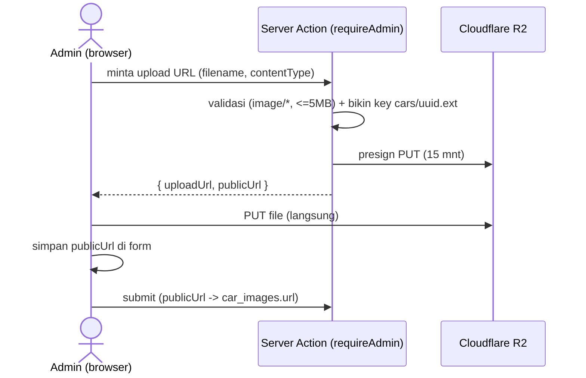

# ADMIN-CMS-PLAN — Improve admin jadi CMS matang

> **Status:** Draft v1 · rencana (belum dikoding). Lanjutan dari admin CMS MVP (PR #2).
> Fokus: upload foto nyata (R2), edit entitas di halaman detail (bukan modal), detail booking + booking manual.
> Prinsip tetap: tiap fitur **test dulu** (repo smoke + UI login) sebelum lanjut. Auth/RLS/repo sudah ada.

---

## 0. Kenapa berubah (MVP → matang)

| Sekarang (MVP, PR #2) | Target |
|---|---|
| Foto = input URL `/images/...` | **Choose file → upload ke Cloudflare R2** |
| Edit armada = modal sempit | **Halaman detail** `/admin/armada/[id]` (galeri + spesifikasi lengkap) |
| Booking = tabel + dropdown status | **Halaman detail** booking (sopir, dokumen, timeline) + **buat booking manual** |
| Entitas ringan (lokasi) = modal | Tetap modal (cukup) |

Pola besar: **daftar → klik baris → halaman detail** untuk entitas kaya (armada, booking). Modal hanya untuk yang ringan.

---

## 1. Storage foto — Cloudflare R2

**Kenapa R2:** S3-compatible, **zero egress fee**, murah, bucket publik via custom domain / `r2.dev`.

### 1.1 Yang perlu disiapkan (oleh owner, sekali)
- Buat bucket R2 (mis. `folkadrive-assets`).
- Aktifkan akses publik (custom domain mis. `cdn.folkadrive.com`, atau subdomain `pub-xxx.r2.dev`).
- CORS bucket: izinkan `PUT` dari origin app.
- Buat API token (Access Key + Secret).

### 1.2 Env (RAHASIA, server-only — bukan NEXT_PUBLIC)
```
R2_ACCOUNT_ID=...
R2_ACCESS_KEY_ID=...
R2_SECRET_ACCESS_KEY=...
R2_BUCKET=folkadrive-assets
R2_PUBLIC_BASE_URL=https://cdn.folkadrive.com
```

### 1.3 Arsitektur upload — presigned URL (langsung browser → R2)
Tidak lewat server (tanpa batas body, hemat CPU server).



### 1.4 File baru
- `lib/storage/r2.ts` — S3 client (`@aws-sdk/client-s3` + `s3-request-presigner`), `presignUpload(key, type)`, `publicUrl(key)`.
- `app/admin/_actions/upload.ts` — `createUploadUrlAction({filename, contentType})` (requireAdmin, validasi type+size, return presigned + publicUrl).
- `components/admin/ImageUpload.tsx` — komponen reusable: drag-drop + choose file + progress + preview + hapus. Output: URL final. Dipakai armada (galeri) & nanti CMS marketing.
- Deps: `@aws-sdk/client-s3`, `@aws-sdk/s3-request-presigner`.

### 1.5 Catatan
- `next.config` sudah `images.unoptimized:true` → URL R2 langsung render. (Kalau nanti mau optimasi, tambah `images.remotePatterns` domain R2.)
- Validasi tipe/ukuran di server action (jangan percaya client).
- Key pakai uuid (hindari tabrak/enumerasi).

---

## 2. Armada — halaman detail (ganti modal)

### 2.1 Rute
- `/admin/armada` — daftar (tabel, sudah ada). Klik baris / Edit → detail.
- `/admin/armada/[id]` — view + edit satu mobil.
- `/admin/armada/baru` — tambah mobil.

### 2.2 Isi halaman detail
- **Galeri foto**: upload multi (`car_images`), urutkan (`sort`), hapus per foto, set kind (exterior/side/interior/gallery).
- **Spesifikasi lengkap**: nama, brand, kategori, warna, kapasitas, transmisi, BBM, tahun + **fitur** (AC, audio, GPS, kursi bayi — daftar) + opsional pintu/bagasi/plat.
- **Tarif & deposit**: lepas kunci, dengan sopir, deposit.
- **Status**: tersedia / nonaktif.

### 2.3 Perubahan schema (additive, opsional tapi disarankan)
```
cars.features   jsonb  default '[]'   -- ["AC","Audio","GPS"]
cars.doors      int    null
cars.luggage    int    null
cars.plate      text   null           -- nomor polisi (internal)
```
Migration baru `0003_car_specs.sql` via Supabase MCP (pola sama).

### 2.4 File
- `app/admin/armada/[id]/page.tsx` (server fetch getCarById) + `app/admin/armada/baru/page.tsx`.
- `app/admin/armada/CarForm.tsx` — form halaman penuh (ganti `CarFormDialog`), pakai `ImageUpload`.
- Repo: tambah manajemen foto granular (`addCarImage`, `removeCarImage`, `reorderCarImages`) atau tetap replace + galeri.
- Hapus `CarFormDialog.tsx` setelah migrasi.

---

## 3. Booking — halaman detail + booking manual

### 3.1 Rute
- `/admin/booking` — daftar (sudah ada).
- `/admin/booking/[code]` — detail booking.
- `/admin/booking/baru` — buat booking manual.

### 3.2 Halaman detail
- Pelanggan (nama, HP), mobil (link ke detail), tanggal, lokasi ambil/kembali.
- **Sopir** yang ditugaskan (+ ganti sopir di sini).
- **Dokumen** (KTP/SIM dari tabel `documents`) — lihat + status verifikasi (approve/reject).
- Pembayaran (total, deposit, channel).
- **Timeline status** + ubah status (pending→confirmed→active→completed/cancelled).

### 3.3 Booking manual
- Form: pilih mobil (cari), rentang tanggal (**cek ketersediaan**, anti double-booking), pelanggan (nama/HP), mode (lepas kunci/sopir), lokasi, sopir opsional, total (auto via `calcPrice` atau override manual), channel `web_wa`.
- Backend `createBooking` sudah dukung semua field ini — tinggal form admin + action wrapper.

### 3.4 File
- `app/admin/booking/[code]/page.tsx` + `app/admin/booking/baru/page.tsx`.
- `app/admin/booking/BookingDetail.tsx`, `app/admin/booking/ManualBookingForm.tsx`.
- Repo: `getBookingDetail(tenantId, code)` (booking + car + driver + locations + documents) ; `listDocuments(bookingId)`.

---

## 4. Fase + testing (urutan eksekusi)

| Fase | Isi | Test |
|---|---|---|
| **A. Storage** | R2 client + `createUploadUrlAction` + `ImageUpload` komponen | upload file → ada di R2 → URL kebuka; type/size ditolak |
| **B. Armada detail** | `[id]` + `baru` + `CarForm` + galeri upload + schema specs | smoke repo + UI login: tambah/edit mobil + foto upload, hapus foto |
| **C. Booking detail** | `[code]` + `getBookingDetail` + dokumen/sopir/timeline | UI: lihat detail, ganti status/sopir, verifikasi dokumen |
| **D. Booking manual** | `baru` + `ManualBookingForm` | UI: buat booking, cek anti double-booking, muncul di list/akun |

Tiap fase: `pnpm typecheck` + smoke repo + UI test login + commit atomik. Branch lanjut `feat/admin-cms` (atau cabang baru `feat/admin-cms-v2`).

---

## 5. Keputusan & risiko

- **R2 setup butuh kredensial owner** — aku tak bisa bikin akun/bucket R2. Owner siapkan bucket + token + 5 env. Sampai itu ada, Fase A pakai stub/Supabase Storage sementara untuk test.
- **Presigned upload** dipilih (vs proxy server) — tanpa batas body, hemat server. Perlu CORS R2 benar.
- **Schema specs** = migration additive (aman, tak rusak data).
- **CarFormDialog** dibuang setelah halaman detail siap (hindari 2 jalur edit).
- Lokasi & sopir tetap modal (entitas ringan) — tak perlu halaman detail.

---

_Plan awal — iteratif. Konfirmasi fase mana dieksekusi dulu setelah review._
