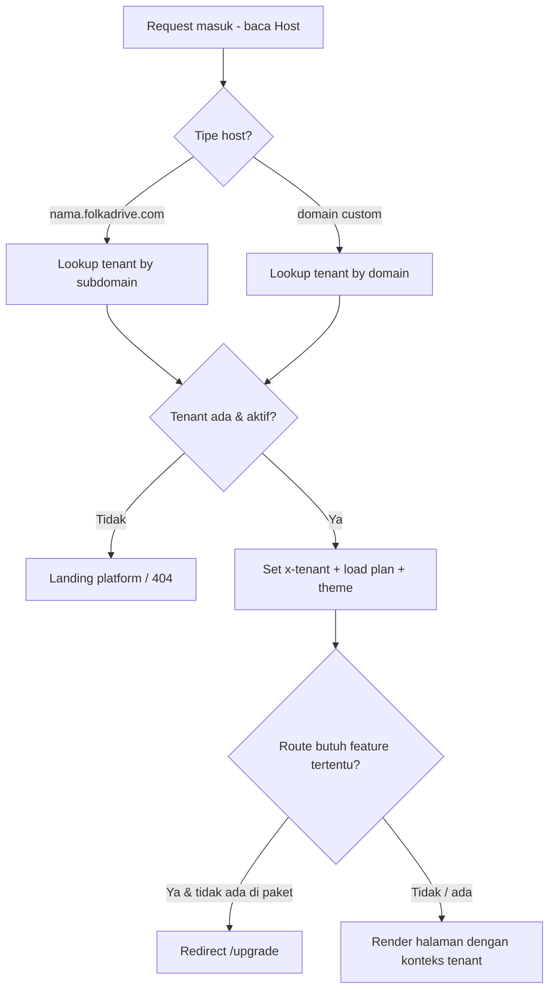
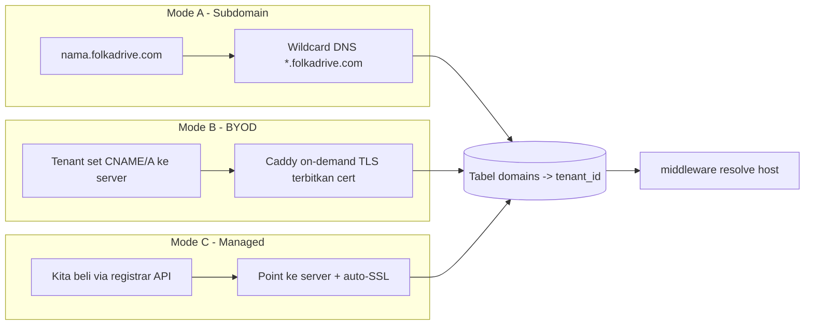
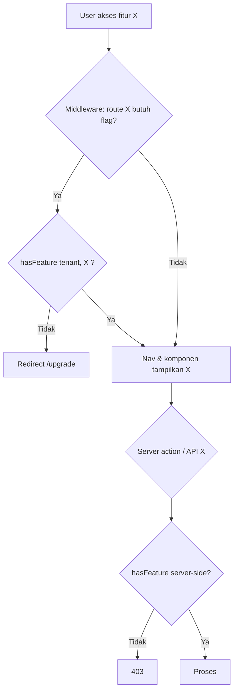
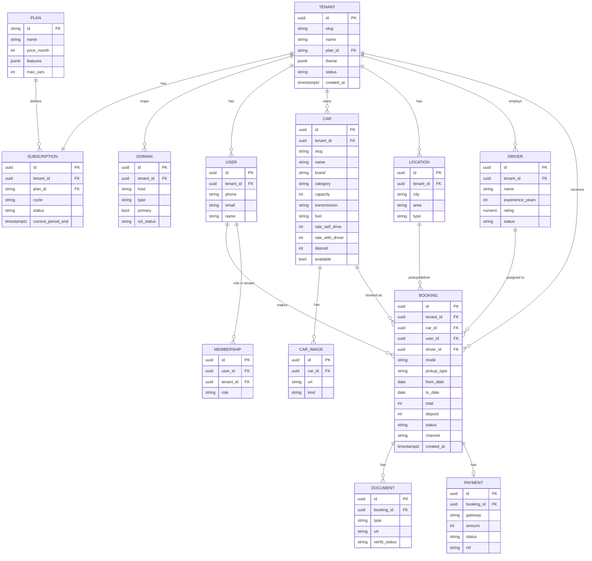
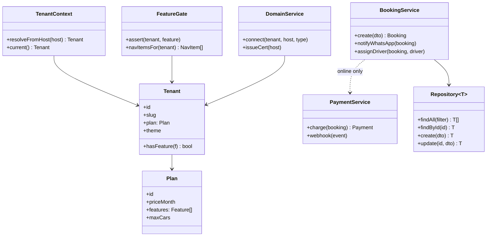
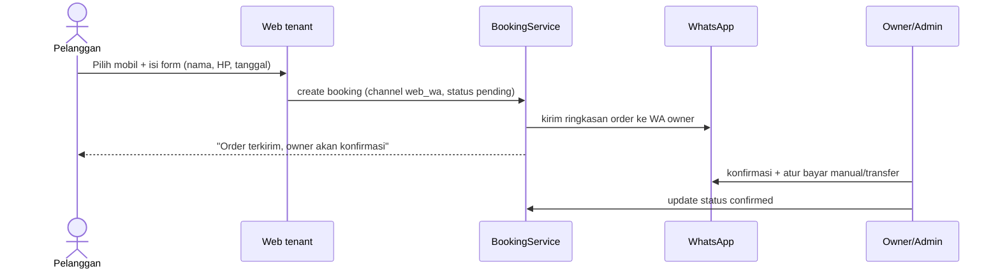
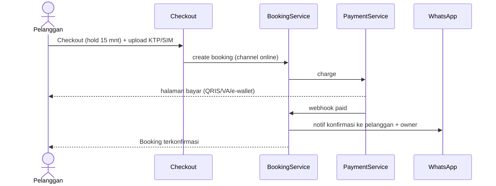
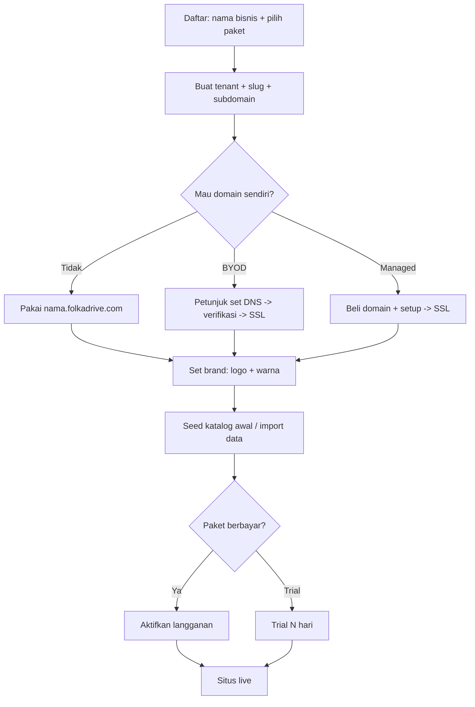

# SAAS-PLAN — FolkaDrive Multi-Tenant

> **Status:** Draft v1 · 2026-06-15 · **Rencana awal (belum dikoding)**
> Rencana mengubah mockup single-site jadi **white-label multi-tenant SaaS**.
> Harga & paket: [`docs/PRICING.md`](PRICING.md) · Produk: [`docs/PRD.md`](PRD.md) · Visual: [`DESIGN.md`](../DESIGN.md)
> Diagram pakai **Mermaid** (render otomatis di GitHub/VS Code).

---

## 1. Tujuan

Satu codebase melayani **banyak bisnis rental (tenant)**, tiap tenant punya:
- Website branded sendiri (subdomain / domain sendiri / domain dikelola kita).
- Fitur dibatasi sesuai **paket** (Starter → Enterprise).
- Data terisolasi penuh antar-tenant.

---

## 2. Kondisi sekarang vs target

| Aspek | Sekarang (mockup) | Target (SaaS) |
|---|---|---|
| Data | `lib/mock/*` (in-memory) | Postgres + Drizzle, ber-`tenant_id` |
| Auth | stub OTP (UI) | better-auth, scoped per tenant + RBAC |
| Tenant | tidak ada | resolusi via host (subdomain/custom domain) |
| Fitur | semua nyala | feature-flag per paket |
| Tema | token global | override per tenant (logo, warna) |
| Hosting | belum deploy | VPS + Caddy on-demand TLS + PM2 |
| Pembayaran | mock | Midtrans (Enterprise, on-request) |

**Aset yang mempermudah:** `styles/tokens.css` (semua warna = CSS var → white-label gampang), `middleware.ts` (titik resolusi tenant sudah ada), i18n terpusat, data lewat `lib/mock/*` (belum di-hardcode di JSX).

---

## 3. Model tenancy

- **Tenant = 1 bisnis rental.**
- **Isolasi data:** Shared DB + kolom `tenant_id` di semua tabel domain + **Postgres Row Level Security (RLS)**. Murah, scale ribuan tenant, isolasi dijamin DB (bukan cuma app).
- **Resolusi tenant:** dari `Host` request → `middleware.ts` → set header `x-tenant` → RSC baca via `headers()`.
- **Super-admin (platform/kamu)** terpisah dari **admin tenant**.

---

## 4. Penanganan domain (3 mode)

- **SSL otomatis:** Caddy **on-demand TLS** (cocok rencana VPS) — wildcard subdomain + custom domain dapat HTTPS tanpa konfig manual per tenant.
- **Ownership:** managed domain atas nama tenant; churn → domain tetap milik tenant.

---

## 5. Feature flags (inti gating)

`Plan` → himpunan `Feature`. `Tenant` punya `plan`. Cek `hasFeature(tenant, x)`.

**Enforcement 3 lapis (jangan cuma UI):**
1. **Middleware (hard gate)** — route ke-gate (mis. `/akun`, `/checkout`) ditolak/redirect kalau paket tak punya fiturnya. = keamanan.
2. **Navigasi (hide)** — filter `Header.navItems` & tombol by feature. = UX.
3. **Komponen/API (`<Gate feature>`)** — bungkus bagian fitur; route handler tolak server-side.

Daftar flag & pemetaan paket: lihat [`docs/PRICING.md`](PRICING.md) §6.

---

## 6. Struktur database (Postgres + Drizzle)

Semua tabel domain punya `tenant_id` (FK → `tenants.id`) + RLS policy `tenant_id = current_setting('app.tenant_id')`.

### 6.1 ER Diagram

### 6.2 Catatan tabel
- `tenants.theme` (jsonb): `{ accent, ink, logoUrl, ... }` → inject CSS var di layout.
- `plans.features` (jsonb array): daftar flag aktif (selaras `lib/tenant/features.ts`).
- `bookings.channel`: `web_wa` | `online` (online hanya Enterprise).
- `bookings.status`: `pending` → `confirmed` → `active` → `completed` / `cancelled`.
- `documents.verify_status`: `pending` → `approved` / `rejected` (verifikasi manual admin).
- `payments`: hanya terisi untuk channel `online` (Enterprise).
- **RLS wajib** di semua tabel ber-`tenant_id`. `tenant_id` selalu di-derive server-side dari host — **tidak pernah** dari input user.

---

## 7. UML — domain & service (class diagram)

---

## 8. Flow utama (sequence)

### 8.1 Booking via WhatsApp (Starter–Business)

### 8.2 Booking + bayar online (Enterprise)

### 8.3 Onboarding tenant baru (signup)

---

## 9. Roadmap berfase

> Tetap di prinsip PRD: **fitur minimum, polish maksimum**. Mockup sekarang = fondasi UI siap.

### Fase 0 — Fondasi data (wajib pertama)
- [ ] Pasang Postgres + Drizzle, `next.config` `output: standalone` (sudah).
- [ ] Skema tabel (lihat §6) + `tenant_id` di semua tabel domain.
- [ ] Aktifkan **RLS** + helper set `app.tenant_id` per request.
- [ ] Ganti `lib/mock/*` → repository ber-tenant (interface sama, sumber beda).
- [ ] Seed 1 tenant demo dari data mock sekarang.

### Fase 1 — Tenancy core
- [ ] `resolveTenant(host)` + perluas `middleware.ts` (subdomain → `x-tenant`).
- [ ] `getTenant()` (RSC, baca header) + inject `theme` ke `app/layout.tsx`.
- [ ] better-auth scoped per tenant + tabel `users`/`memberships` (RBAC).
- [ ] Pisahkan super-admin (platform) dari admin tenant.

### Fase 2 — Feature flags & gating
- [ ] `lib/tenant/features.ts` (PLANS/FEATURES sesuai PRICING §6).
- [ ] Middleware gate route + `<Gate feature>` + filter nav + page `/upgrade`.
- [ ] Terapkan ke komponen mockup (SearchBar/Checkout/akun/admin sesuai tabel flag).

### Fase 3 — Domain & white-label
- [ ] Tabel `domains` + Caddy on-demand TLS (BYOD + managed).
- [ ] Inject brand penuh (logo/warna) per tenant; flag `white_label` hapus badge.
- [ ] Alur konek domain di onboarding.

### Fase 4 — Billing, analytics, ops
- [ ] Self-serve signup + langganan (Midtrans/Stripe) + webhook ubah `plan`.
- [ ] Super-admin dashboard (kelola tenant, paket, status).
- [ ] Analytics/laporan + rekap + export (Business).
- [ ] Multi-admin/RBAC (Business), multi-cabang.

### Fase 5 — Enterprise (on-request)
- [ ] Bayar online end-to-end (checkout + gateway + verifikasi) per tenant.
- [ ] GPS/telematics integrasi, API publik, SLA.

---

## 10. Risiko & mitigasi

| Risiko | Mitigasi |
|---|---|
| Kebocoran data antar-tenant | **RLS di DB** (bukan cuma filter app) + `tenant_id` selalu dari host server-side |
| Bypass gating via URL manual | Hard gate di middleware + cek server-side di tiap action/API |
| Biaya domain managed membengkak | Jadikan add-on (bukan harga dasar); margin di retail |
| Mix klien Starter-heavy → ARR tipis | Upsell Growth, batasi Starter, push tahunan |
| SSL custom domain ribet | Caddy on-demand TLS (otomatis) |
| Churn bawa kabur domain | Domain atas nama tenant + ToS jelas |
| Build vs beli (PRD §13) | Bangun kustom karena tenancy+brand = pembeda; evaluasi ulang tiap fase |

---

## 11. Stack (konfirmasi, selaras CLAUDE.md)

Next.js 15 (App Router, RSC) · TS strict · Tailwind v4 + tokens · Postgres 16 + Drizzle + **RLS** · better-auth (OTP, tenant-scoped) · Midtrans (Enterprise) · VPS + **Caddy on-demand TLS** + PM2 · object storage (R2/S3) untuk foto · Mermaid untuk dokumentasi.

---

_Plan awal — iteratif. Update dokumen ini tiap fase selesai._
